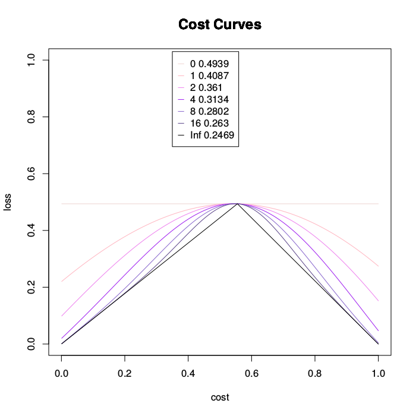

# ThresholdChoiceMethods With Uncertainty

In this repository you can find R code for testing different Threshold Choice Methods With  Context Uncertainty

The threshold choice methods are described in the paper:
["A unified view of performance metrics: translating threshold choice into expected classification loss"](http://dl.acm.org/citation.cfm?id=2503332)
J Hernández-Orallo, P Flach, C Ferri - The Journal of Machine Learning Research, 2012

This software has been developed by Cèsar Ferri, José Hernández Orallo and Peter Flach.

* Generate areas for the threshold choice methods for a set of datasets and a certain level of certainty [experiments_binomial_v72](experiments_binomial_v72.R)
* Produce latex tables from the results generated by the previous script [results](results.R)
* Plot an example of a learning method and a given dataset [plot_example_noise](plot_example_noise.R)
* Plot an example of a learning method and a given dataset and different levels of certainty [plot_example_noise_gamma](plot_example_noise_gamma.R)
* Simulate analytically and example for different levels of certainty [simul_alphabeta](simul_alphabeta.R)
* Generate some plots comparing the results of different learning methods [comp_meths2](comp_meths2.R), [Plot_meas](Plot_meas.R)

